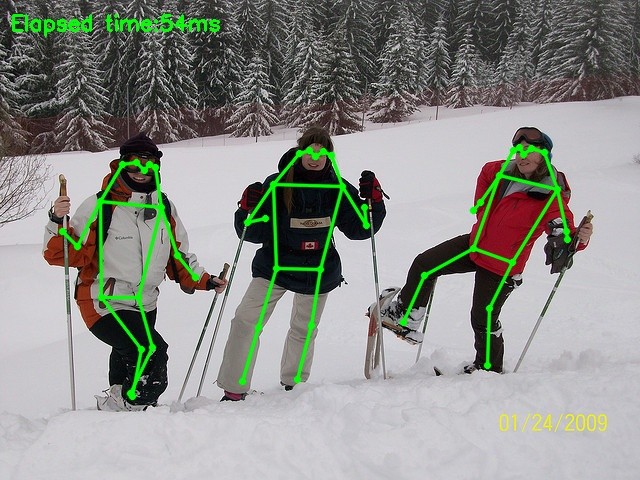

# 1 Preparatory work
## 1.1 unity-onnxruntime

Since it cannot be downloaded from NPM, refer to `manifest.json` and unzip [com.github.asus4.onnxruntime.win-x64-gpu-0.2.6](https://github.com/asus4/onnxruntime-unity/releases/tag/v0.2.6) to directory `/Packages/`.

## 1.2 LFS
Because git lfs is used to manage the model files, follow the [instructions](https://git-lfs.com/) if you do not have git lfs installed.

## 1.3 python environment
```bash
conda create -n onnx python==3.8
conda activate onnx
pip install numpy onnxruntime opencv-python
```

# 2 Run demo

## 2.1 Python
Activate the `onnx` environment and run the command below.
```bash
# `cd` to the root path of this project
python demo_e2pose.py
```
If you go well, you will get the following output in the console, and you will get a picture of the skeleton drawn as shown below.
```bash
84: 0.9496101140975952
88: 0.9683961868286133
92: 0.9672316312789917
save to Assets/Textures\000000041990_output.jpg
```


## 2.2 Unity

**Play** the `Assets/Scenes/TestE2Pose` scene, and than press the `space` button. You will see the image inside the game view and some output in console tab.

# 3 Note

## 3.1 Picture
The image used is from the coco dataset `val2017 000000041990.jpg`.


## 3.2 E2Pose
The **ort** file of **E2pose** is the onnx file downloaded in [PINTO_model_zoo](https://github.com/PINTO0309/PINTO_model_zoo/tree/main/333_E2Pose) and converted by the instructions in [onnxruntime-unity-examples](https://github.com/asus4/onnxruntime-unity-examples?tab=readme-ov-file#how-to-convert-onnx-to-ort-format).

File [demo_e2pose.py](demo_e2pose.py) is modified from file  [demo_E2Pose_onnx.py](https://github.com/PINTO0309/PINTO_model_zoo/blob/main/333_E2Pose/demo/demo_E2Pose_onnx.py) in PINTO.